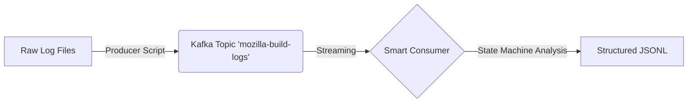

```markdown
# 🔍 Mozilla Log Ingestion & Analysis Pipeline


## 👤 Author: **OUSSAMA LAGHCHIM** - *Data & Analytics Engineer*


## 📋 Overview

This project implements a scalable **Real-time Log Ingestion Pipeline** designed to process unstructured Mozilla CI build logs.

Unlike traditional setups, this project uses **Apache Kafka in Kraft Mode** (removing the dependency on ZooKeeper) and implements a **"Smart Consumer"** pattern using a state-machine approach to restructure raw logs into semantically rich JSON data.

## 🏗️ Architecture

The pipeline is fully containerized using Docker and consists of three main components:



1. **Kafka (Kraft Mode):** A single-node Kafka broker running without ZooKeeper for metadata management.
2. **Log Producer:** Simulates real-time log generation by reading historical build logs and streaming them line-by-line.
3. **Smart Consumer:** An intelligent consumer that applies regex-based parsing and maintains a "Build State" context to enrich logs with step information (e.g., `compile`, `test`, `upload`).

## 📂 Project Structure

```bash
.
├── docker-compose.yml   # Infrastructure definition (Kafka + App)
├── Dockerfile           # Python environment setup
├── requirements.txt     # Python dependencies
├── logs/                # 📂 PUT YOUR RAW .txt FILES HERE
├── output/              # 📂 Destination for structured JSON
└── src/
    ├── producer.py      # Streams raw logs to Kafka
    └── consumer.py      # "Smart" parsing & context enrichment

```

## 🚀 Getting Started

### Prerequisites

* Docker & Docker Compose installed on your machine.

### Installation

1. **Clone the repository:**
```bash
git clone [https://github.com/votre-user/mozilla-log-pipeline.git](https://github.com/votre-user/mozilla-log-pipeline.git)
cd mozilla-log-pipeline

```


2. **Prepare the environment:**
Create the necessary directories if they don't exist:
```bash
mkdir logs output

```


3. **Add Data:**
Place your `.txt` log files (Mozilla build logs) inside the `logs/` directory.
4. **Start the Infrastructure:**
```bash
docker-compose up --build -d

```


## 🏃‍♂️ Usage

To observe the pipeline in action, you will need two terminal windows.

### Terminal 1: Start the Consumer

This service listens to the Kafka topic and processes data as it arrives.

```bash
# Standard Command
docker exec -it log-processor python /app/src/consumer.py

# ⚠️ Windows Git Bash Users: Use double slashes
docker exec -it log-processor python //app/src/consumer.py

```

### Terminal 2: Start the Producer

This service reads the files from `logs/` and pushes them to Kafka.

```bash
# Standard Command
docker exec -it log-processor python /app/src/producer.py

# ⚠️ Windows Git Bash Users: Use double slashes
docker exec -it log-processor python //app/src/producer.py

```

## 🧠 "Smart Consumer" Logic

The standard log parser is stateless. Our **Smart Consumer** implements a state machine:

* **Idle State:** Waits for a `========= Started 'step_name' =========` pattern.
* **Active State:** Captures the current step name (e.g., `compile`).
* **Enrichment:** Every subsequent log line is tagged with `step_context: "compile"`.
* **End State:** Detects `========= Finished 'step_name' =========` and calculates duration/result.

**Example Output (JSON):**

```json
{
  "timestamp": "16:37:15",
  "log_level": "ERROR",
  "message": "gcc: error: file not found",
  "step_context": "compile_source",
  "builder": "mozilla-esr52"
   ...
}

```

## 🛠️ Troubleshooting

**"Manifest unknown" error:**
Make sure you are using the correct Docker image in `docker-compose.yml`. We recommend `confluentinc/cp-kafka:7.6.0` for stability.

**"No such file or directory":**
If you are on Windows using Git Bash, Docker paths need double slashes (`//app/src/...`) to prevent auto-conversion.


```
